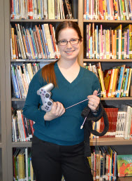
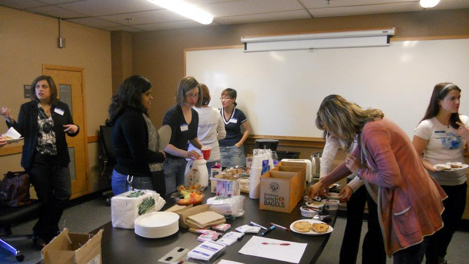



# Personal Information

## Name
Allison Brown

## Email
Allison.Thompson@Colorado.EDU

## Photo

## Website
http://www.scribblefix.com

# Current Funding
None; on academic leave for Fall 2014

# PhD Program

## Thesis Advisor
Clayton Lewis

## Committee
Undecided

## Milestones

| Milestone            | Completed         | Planned           |         
| -------------------- | ----------------- | ----------------- |
| Start                | Fall 2009     |                   |
| Area Exam            | Spring 2011   | N/A   |
| Proposal Defense     |           | Fall 2015     |
| Dissertation Defense |     | Fall 2016     |

## Courses (listed in order taken)

| Course           							| Taken                 | Planned         | Depth | Breadth | 
| --------------------------------------------------------------------- | --------------------- | --------------- | ----- | ------- |
| CSCI 5444 Introduction to Theory of Computation 			| Fall 2009		| N/A   | no  | yes   |
| CSCI 5448 Object-Oriented Analysis and Design			| Fall 2009 	| N/A   | no  | yes   |
| CSCI 6000 Introduction to the Computer Science Ph.D. Program 	| Fall 2009 	| N/A   | no  | yes   |
| CSCI 5454 Design and Analysis of Algorithms 			| Spring 2010 	| N/A | yes | no    |	
| CSCI 5535 Fundamentals of Programming Languages 			| Spring 2010 	| N/A | no  | yes   |	
| CSCI 5832 Natural Language Processing 				| Spring 2010 	| N/A | no  | yes    |	
| CSCI 7000 Inference, Models, and Simulation for Complex Systems 	| Fall 2010 	| N/A  | yes | no    |
| CSCI 7154 Complexity of Computations 				| Fall 2010 	| N/A   | yes | no    |
| CSCI 5446 Chaotic Dynamics	 				| Spring 2011 	| N/A | no  | yes   |	
| CSCI 7154 Research Problems: Theoretical Computer Science 	| Spring 2011 	| N/A | yes | no    |	
| CSCI 5839 User-Centered Design 					| Fall 2011 	| N/A   | no  | yes   |		
| CSCI 7900 Doctoral Level Independent Study 			| Fall 2011 	| N/A   | yes | no    |
| PSYC 5741 General Statistics 					| Fall 2012 	| N/A  | yes | no    |

# Research

## Publications

* Christopher Schaebauer, Katie A. Siek, Sarah Hug, and Allison T. Brown. Health awareness: Extending traditional health curricula with computational thinking (not final, under review).
* Andrzej Ehrenfeucht, Michael Main, Gregorz Rozenberg, and Allison Thompson Brown. Stability and chaos in reaction systems. _International Journal of Foundations of Computer Science_, 23(5):1173–1184, 2012.
* Allison T. Brown, Kaitlin Hegarty, Aileen McCollum, and Colin Twaddell. KidArt: displaying children's art in the home. In _Proceedings of the 2012 ACM annual conference extended abstracts on Human Factors in Computing Systems Extended Abstracts (CHI EA '12)_. CHI SDC, 25% acceptance rate.
* Allison T. Brown and Elizabeth Bradley, An Experimental Exploration of the Dynamics of Kneading, _12th experimental chaos and complexity conference_, acceptance rate unknown.
* Allison Thompson (Brown). Automated generation of website content and layout. In _Proceedings from the Michigan Celebration of Women in Computing_, Michigan, USA, 2009. 5 pages, **Best Paper Award**.

## Presentations

* Poster, KidArt: displaying children's art in the home, CHI SDC 2012 ([supplementary material presented to judges]) (ka_supplement.pdf)
* Poster, #Health@You: Promoting wellness and self-monitoring for diabetic teens, CRA-W Grad Cohort 2012 ([poster]) (cohort.pdf)
      
## Awards

* Anita Borg Finalist ($1000 for AY 2013-2014)
* Best On-Site Demo, 12th experimental chaos and complexity conference (May 2012)
* CHI SDC Semi-finalist, with a team of four, May 2012
* CU Innovative Seed Grant for #Health@You (I helped Katie write this; it funded me for the 2012-2013 AY)
* Outstanding Teaching Assistant (Spring 2011, Fall 2010)

# Teaching

* GTPI, CSCI 1300, Summer 2014, CU Boulder
* GTPI, GEEN 1300, Spring 2014, CU Boulder
* TA, CSCI 2270, Fall 2013, CU Boulder
* TA, CSCI 1300, Fall 2010 - Spring 2011, CU Boulder
* TA, Intro to Comp Sci, Fall 2007 & 2008, Calvin College, Grand Rapids, MI
* General Tutor & Homework Assistant, Fall 2006 - Fall 2008, Calvin College, Grand Rapids, MI

# Service

* Short Papers and Posters Program Comittee, Pervasive Healthcare 2013
* Rocky Mountain Celebration of Women in Computing (RMCWiC) - Program Committee Member, 2012-2013
* Organized _CU in CS_, Spring 2012, a day long workshop to introduce high school and open-option engineering students to computing as a career, including informational panels with local female software engineers and CEOs, hands-on computing activities, and short research and informational presentations.
* Consortium for Computing Sciences in Colleges (CCSC), Rocky Mountain Chapter - Publicity Chair, 2011-2013
* CU Women in Computing (CUWIC), various positions, 2010-2013
* Reviewed papers for CCSC 2011, Pervasive Healthcare 2012 and 2013,RMCWiC 2012, and CHI 2012 and 2013

# Highlights

## CUWIC welcome breakfast (this is from 2011, but I can’t find more recent pictures).

## Presentation to judges at CHI for the Student Design Competition.

